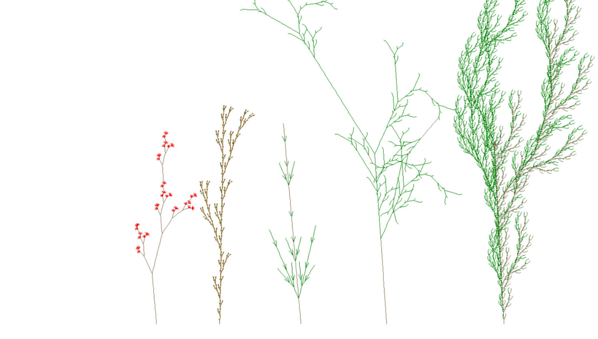
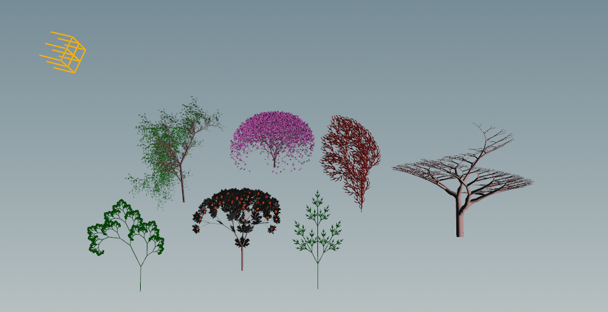

# Development of L-System Grammer

## Decription:

In this project, we implemented L_System in two parts. In the first part, we added the color feature to this system by implementing the code, and in the next part, we explained the rules of growth in 3 dimensions and color in Houdini software.

The following book was used for further study with the following title by Przemyslaw Prusinkiewicz and Aristid Lindenmayer:

"The Algorithmic Beauty of Plants"

## Result

By generating different rules and including color in the rules, we drew plant species (trees) in different states because the generation is set randomly. In general, we showed in two random modes and in the third generation and the fourth generation to understand the difference in the number of repetitions in pattern generation in this system.

By using the definition of different rules in the Houdini software, we put all the species together to have a forest of seven types of species.

