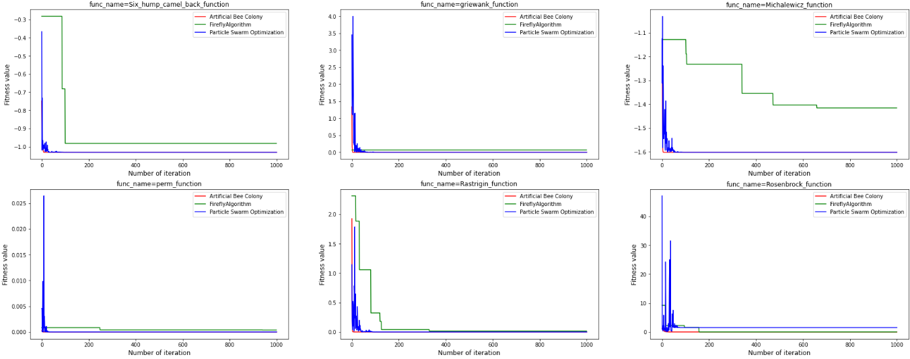

# Optimization inspired by nature

## Decription:

In this project, we  solved some standard and common optimization problems that are used to compare optimization algorithms using the algorithms of Artificial Bee Colony, Firefly algorithm and Particle Swarm Optimization and compared their efficiency.

The optimization problems used in this project is related to an article with the following title by Simon Vandevelde and Joost Vennekens:

"ProbLife: a Probabilistic Game of Life"

## Result

In terms of optimality, we compare each function in 3 algorithms with *f found in the article
According to the results of the tables for each test function in the 3 algorithms, we can see that in all the functions, the optimization has occurred in the 3 algorithms, but in general, the Artificial Bee Colony algorithm has worked more accurately and was able to be closer to the optimal point in get the article

One of the characteristics of these 3 algorithms is the high convergence speed, but if we draw the following graphs for each function, we can see that in all the test functions, the Artificial Bee Colony algorithm is faster than the other two algorithms for this category of optimization problems. Convergence has been reached, which means that the speed of convergence in this algorithm is high, and the two algorithms of Particle Swarm and Firefly are sometimes trapped in the local optimum.

The Firefly algorithm has solved all the test functions with the shortest possible time compared to the other 2 algorithms, and the honey bees algorithm has the longest execution time with about 1 minute and 9 seconds.

